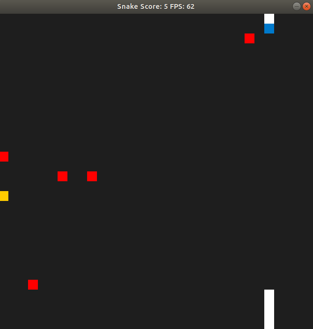

# CPPND: Capstone Snake Game Example

Capstone Project for Udacity Cpp Nanodegree 
The following features have been added to the Snake game repo provided:
1. Additional obstacles which the snake needs to avoid
2. No. of obstacles keeps increasing as the snake grows
3. The location of the food item changes randomly after a duration of 8 to 10 seconds
4. Control speed has been tuned to avoid the obstacles

## Dependencies for Running Locally
* cmake >= 3.7
  * All OSes: [click here for installation instructions](https://cmake.org/install/)
* make >= 4.1 (Linux, Mac), 3.81 (Windows)
  * Linux: make is installed by default on most Linux distros
  * Mac: [install Xcode command line tools to get make](https://developer.apple.com/xcode/features/)
  * Windows: [Click here for installation instructions](http://gnuwin32.sourceforge.net/packages/make.htm)
* SDL2 >= 2.0
  * All installation instructions can be found [here](https://wiki.libsdl.org/Installation)
  * Note that for Linux, an `apt` or `apt-get` installation is preferred to building from source.
* gcc/g++ >= 5.4
  * Linux: gcc / g++ is installed by default on most Linux distros
  * Mac: same deal as make - [install Xcode command line tools](https://developer.apple.com/xcode/features/)
  * Windows: recommend using [MinGW](http://www.mingw.org/)

## Build Instructions

1. Clone this repo.
2. Make a build directory in the top level directory: `mkdir build && cd build`
3. Compile: `cmake .. && make`
4. Run it: `./SnakeGame`.

## Code Structure

The following changes have been made to the code structure of the Snake game repository

1. A vector of obstacles has been added to game.h which keeps getting updated randomly over time
2. The program ensures that the food items and obstacles aren't located at the same place
3. Program detects when the snake hits an obstacle and stops the game 
4. Threads are used to change the location of food randomly if not eaten within a period of 8-10 seconds
5. Mutex are used to prohibit data race during food allocation

## Rubrics Satisfied

### Loops, Functions, I/O

1. The project demonstrates an understanding of C++ functions and control structures.

### Object Oriented Programming

1. The project uses Object Oriented Programming techniques.
2. Class constructors utilize member initialization lists.
3. Classes encapsulate behavior.

### Memory Management

1. The project makes use of references in function declarations.

### Concurrency

1. The project uses multithreading.
2. A mutex or lock is used in the project.
